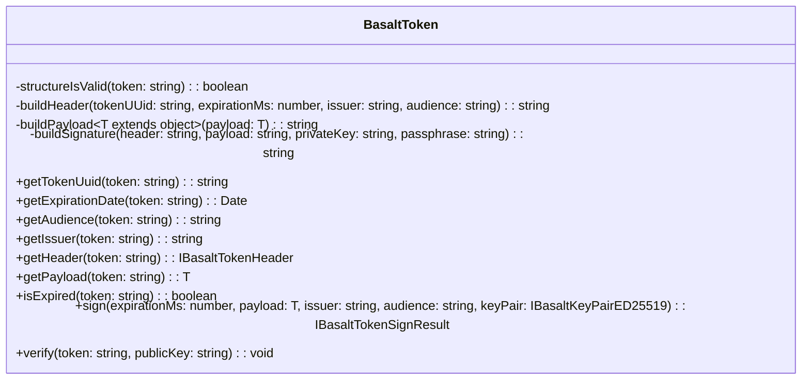

# **Class Reference for Token**

`BasaltToken` is a utility class designed for token management, including token generation, verification, and utility methods to get information from the token.

## **Diagram**

## **Public Methods**

### `getTokenUuid`

???+ info "getTokenUuid"

    - **Description**: Retrieves the UUID from the token.
    - **Signature**: `public getTokenUuid(token: string): string`
    - **Parameters**:
        - `token`: The token from which to extract the UUID.
    - **Returns**: The UUID of the token as a string.

### `getExpirationDate`

???+ info "getExpirationDate"

    - **Description**: Gets the expiration date of the token.
    - **Signature**: `public getExpirationDate(token: string): Date`
    - **Parameters**:
        - `token`: The token to check.
    - **Returns**: The expiration date of the token.

### `getAudience`

???+ info "getAudience"

    - **Description**: Retrieves the audience from the token.
    - **Signature**: `public getAudience(token: string): string`
    - **Parameters**:
        - `token`: The token from which to extract the audience.
    - **Returns**: The audience of the token as a string.

### `getIssuer`

???+ info "getIssuer"

    - **Description**: Retrieves the issuer from the token.
    - **Signature**: `public getIssuer(token: string): string`
    - **Parameters**:
        - `token`: The token from which to extract the issuer.
    - **Returns**: The issuer of the token as a string.

### `getHeader`

???+ info "getHeader"

    - **Description**: Gets the header of the token.
    - **Signature**: `public getHeader(token: string): IBasaltTokenHeader`
    - **Parameters**:
        - `token`: The token to check.
    - **Returns**: The header of the token.
    - **Exceptions**: Throws an error if the token structure is invalid.

### `getPayload`

???+ info "getPayload"

    - **Description**: Gets the payload of the token.
    - **Signature**: `public getPayload<T extends object>(token: string): T`
    - **Parameters**:
        - `token`: The token to check.
    - **Returns**: The payload of the token.
    - **Exceptions**: Throws an error if the token structure is invalid.

### `isExpired`

???+ info "isExpired"

    - **Description**: Checks if the token is expired.
    - **Signature**: `public isExpired(token: string): boolean`
    - **Parameters**:
        - `token`: The token to check.
    - **Returns**: `true` if the token is expired, otherwise `false`.

### `sign`

???+ info "sign"

    - **Description**: Signs a token.
    - **Signature**: `public sign<T extends object>(expirationMs: number, payload: T, issuer: string = 'YourAppName-Issuer', audience: string = 'YourAppName-Audience', keyPair: IBasaltKeyPairED25519 = new BasaltKeyGenerator().generateKeyPairED25519()): IBasaltTokenSignResult`
    - **Parameters**:
        - `expirationMs`: The expiration time in milliseconds.
        - `payload`: The payload to be signed.
        - `issuer`: The issuer of the token. (default is 'YourAppName-Issuer')
        - `audience`: The audience for the token. (default is 'YourAppName-Audience')
        - `keyPair`: The key pair for signing. (default is a new ED25519 key pair)
    - **Returns**: The signed token and related information.

### `verify`

???+ info "verify"

    - **Description**: Verifies a token's signature and expiration date.
    - **Signature**: `public verify(token: string, publicKey: string): void`
    - **Parameters**:
        - `token`: The token to verify.
        - `publicKey`: The public key to use for verification.
    - **Exceptions**: Throws errors for invalid token structure, expired token, or invalid token signature.

