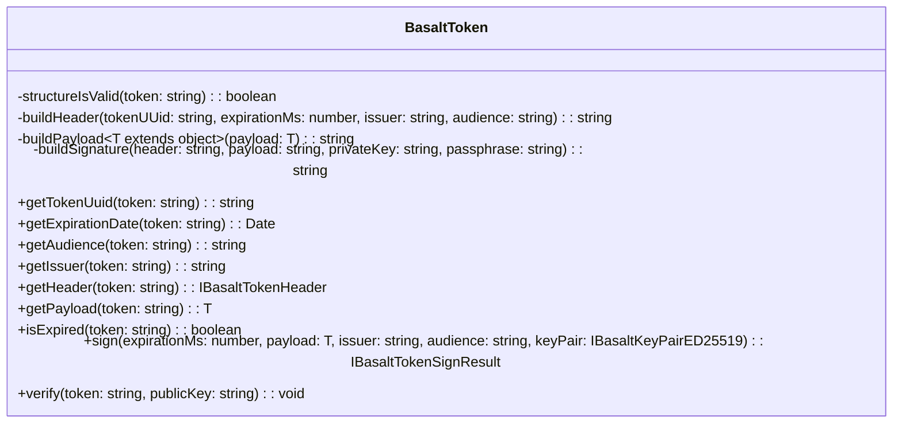

## **Class Reference for Token**

`BasaltToken` is a utility class designed for token management, including token generation, verification, and utility methods to get information from the token.

## **Diagramme**

## **Méthodes publiques**

Ci-dessous, vous trouverez les détails techniques de chaque méthode publique disponible.

### `getTokenUuid`

???+ info "getTokenUuid"

    - **Description**: Récupère l'UUID à partir du token.
    - **Signature**: `public getTokenUuid(token: string): string`
    - **Paramètres**:
        - `token`: Le token à partir duquel extraire l'UUID.
    - **Retourne**: L'UUID du token sous forme de chaîne de caractères.

### `getExpirationDate`

???+ info "getExpirationDate"

    - **Description**: Obtient la date d'expiration du token.
    - **Signature**: `public getExpirationDate(token: string): Date`
    - **Paramètres**:
        - `token`: Le token à vérifier.
    - **Retourne**: La date d'expiration du token.

### `getAudience`

???+ info "getAudience"

    - **Description**: Récupère le public destinataire à partir du token.
    - **Signature**: `public getAudience(token: string): string`
    - **Paramètres**:
        - `token`: Le token à partir duquel extraire le public destinataire.
    - **Retourne**: Le public destinataire du token sous forme de chaîne de caractères.

### `getIssuer`

???+ info "getIssuer"

    - **Description**: Récupère l'émetteur à partir du token.
    - **Signature**: `public getIssuer(token: string): string`
    - **Paramètres**:
        - `token`: Le token à partir duquel extraire l'émetteur.
    - **Retourne**: L'émetteur du token sous forme de chaîne de caractères.

### `getHeader`

???+ info "getHeader"

    - **Description**: Obtient l'en-tête du token.
    - **Signature**: `public getHeader(token: string): IBasaltTokenHeader`
    - **Paramètres**:
        - `token`: Le token à vérifier.
    - **Retourne**: L'en-tête du token.
    - **Exceptions**: Lance une erreur si la structure du token est invalide.

### `getPayload`

???+ info "getPayload"

    - **Description**: Obtient la charge utile du token.
    - **Signature**: `public getPayload<T extends object>(token: string): T`
    - **Paramètres**:
        - `token`: Le token à vérifier.
    - **Retourne**: La charge utile du token.
    - **Exceptions**: Lance une erreur si la structure du token est invalide.

### `isExpired`

???+ info "isExpired"

    - **Description**: Vérifie si le token est expiré.
    - **Signature**: `public isExpired(token: string): boolean`
    - **Paramètres**:
        - `token`: Le token à vérifier.
    - **Retourne**: `true` si le token est expiré, sinon `false`.

### `sign`

???+ info "sign"

    - **Description**: Signe un token.
    - **Signature**: `public signer<T extends object>(expirationMs: number, payload: T, issuer: string = 'VotreNomApp-Émetteur', audience: string = 'VotreNomApp-Audience', keyPair: IBasaltKeyPairED25519 = new BasaltKeyGenerator().generateKeyPairED25519()): IBasaltTokenSignResult`
    - **Paramètres**:
        - `expirationMs`: Le temps d'expiration en millisecondes.
        - `payload`: La charge utile à signer.
        - `issuer`: L'émetteur du token. (par défaut c'est 'VotreNomApp-Émetteur')
        - `audience`: Le public destinataire du token. (par défaut c'est 'VotreNomApp-Audience')
        - `keyPair`: La paire de clés pour la signature. (par défaut c'est une nouvelle paire de clés ED25519)
    - **Retourne**: Le token signé et les informations associées.

### `verify`

???+ info "verify"

    - **Description**: Vérifie la signature et la date d'expiration d'un token.
    - **Signature**: `public verifier(token: string, publicKey: string): void`
    - **Paramètres**:
        - `token`: Le token à vérifier.
        - `publicKey`: La clé publique à utiliser pour la vérification.
    - **Exceptions**: Lance des erreurs pour une structure de token invalide, un token expiré ou une signature de token invalide.
