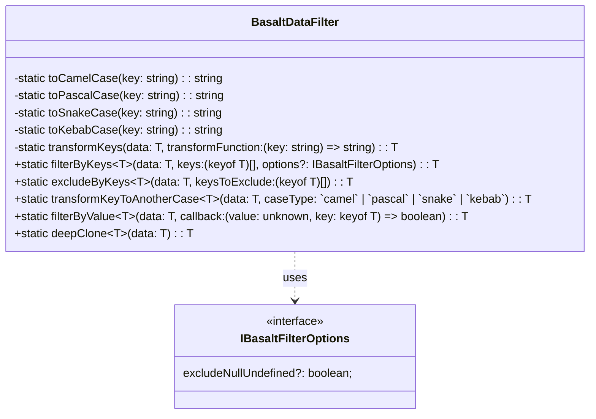

# `BasaltDataFilter Class Reference`

`BasaltDataFilter` provides a set of static methods for filtering and manipulating data objects.

## `Diagram`

## `Public Methods`

Below you will find the technical details of each available method.

### `filterByKeys`
???+ info "filterByKeys"

    - `Description`: Filters data by including only specified keys.
    - `Signature`: `static filterByKeys<T extends object>(data: T, keys: (keyof T)[], options?: IBasaltFilterOptions): T`
    - `Parameters`:
        - `data`: The data object to be filtered.
        - `keys`: The keys to include in the filtered result.
        - `options`: Optional filtering options.
    - `Returns`: The filtered data object.
    - `Exceptions`: Throws an error if data is null, keys are not an array, etc.

### `excludeByKeys`
???+ info "excludeByKeys"

    - `Description`: Filters data by excluding specified keys.
    - `Signature`: `static excludeByKeys<T extends object>(data: T, keysToExclude: (keyof T)[]): T`
    - `Parameters`:
        - `data`: The data object to be filtered.
        - `keysToExclude`: The keys to exclude from the filtered result.
    - `Returns`: The filtered data object.
    - `Exceptions`: Throws an error if data is null, keys are not an array, etc.

### `transformKeyToAnotherCase`
???+ info "transformKeyToAnotherCase"

    - `Description`: Transforms the keys of a data object into another case format.
    - `Signature`: `public static transformKeyToAnotherCase<T extends object>(data: T, caseType: `camel` | `pascal` | `snake` | `kebab`): T`
    - `Parameters`:
        - `data`: The data object to transform.
        - `caseType`: The case type to use for the transformation (camel, pascal, snake, kebab).
    - `Returns`: The data object with transformed keys.

### `filterByValue`
???+ info "filterByValue"

    - `Description`: Filters the items of an object based on their value matching a specified criterion.
    - `Signature`: `public static filterByValue<T extends object, V>(data: T, value: V): T`
    - `Parameters`:
        - `data`: The data object to filter.
        - `value`: The value to use as the criterion for the filtering.
    - `Returns`: A new object containing all items whose values match the criterion.
    - `Exceptions`: Throws an error if `data` is null or if `value` is of an unsupported type.

### `deepClone`
???+ info "deepClone"

    - `Description`: Creates a deep clone of the data object, meaning that nested objects are also cloned rather than being referenced.
    - `Signature`: `public static deepClone<T extends object>(data: T): T`
    - `Parameters`:
        - `data`: The data object to clone.
    - `Returns`: A deep clone of the original data object.
    - `Exceptions`: Throws an error if `data` is null or uncloneable.
