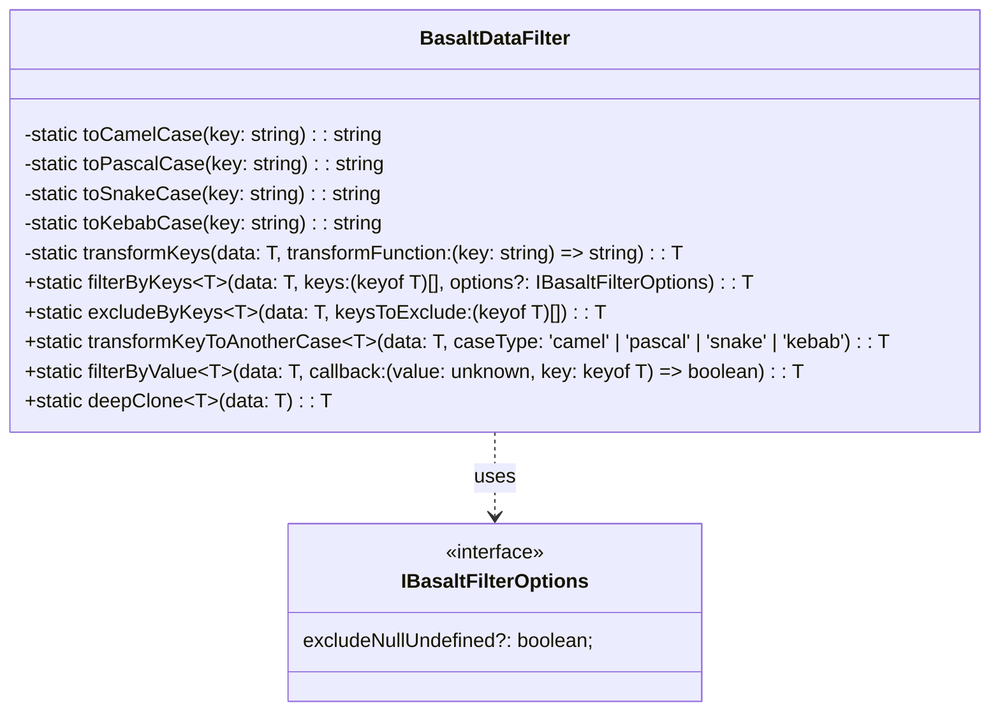

# **Référence de la classe BasaltDataFilter**

`BasaltDataFilter` fournit un ensemble de méthodes statiques pour filtrer et manipuler des objets de données.

## **Diagram**

## **Méthodes publiques**

Ci-dessous, vous trouverez les détails techniques de chaque méthode disponible.

### `filterByKeys`
???+ info "filterByKeys"

    - **Description** : Filtre les données en incluant uniquement les clés spécifiées.
    - **Signature** : `static filterByKeys<T extends object>(data: T, keys: (keyof T)[], options?: IBasaltFilterOptions): T`
    - **Paramètres** :
        - `data` : L'objet de données à filtrer.
        - `keys` : Les clés à inclure dans le résultat filtré.
        - `options` : Options de filtrage facultatives.
    - **Renvoie** : L'objet de données filtré.
    - **Exceptions** : Lance une erreur si les données sont nulles, si les clés ne sont pas un tableau, etc.

### `excludeByKeys`
???+ info "excludeByKeys"

    - **Description** : Filtre les données en excluant les clés spécifiées.
    - **Signature** : `static excludeByKeys<T extends object>(data: T, keysToExclude: (keyof T)[]): T`
    - **Paramètres** :
        - `data` : L'objet de données à filtrer.
        - `keysToExclude` : Les clés à exclure du résultat filtré.
    - **Renvoie** : L'objet de données filtré.
    - **Exceptions** : Lance une erreur si les données sont nulles, si les clés ne sont pas un tableau, etc.

### `transformKeyToAnotherCase`
???+ info "transformKeyToAnotherCase"

    - **Description** : Transforme les clés d'un objet de données dans un autre format de casse.
    - **Signature** : `public static transformKeyToAnotherCase<T extends object>(data: T, caseType: 'camel' | 'pascal' | 'snake' | 'kebab'): T`
    - **Paramètres** :
        - `data` : L'objet de données à transformer.
        - `caseType` : Le type de casse à utiliser pour la transformation (camel, pascal, snake, kebab).
    - **Renvoie** : L'objet de données avec les clés transformées.

### `filterByValue`
???+ info "filterByValue"

    - **Description** : Filtre les éléments d'un objet en fonction de la correspondance de leur valeur avec un critère spécifié.
    - **Signature** : `public static filterByValue<T extends object, V>(data: T, value: V): T`
    - **Paramètres** :
        - `data` : L'objet de données à filtrer.
        - `value` : La valeur à utiliser comme critère pour le filtrage.
    - **Renvoie** : Un nouvel objet contenant tous les éléments dont les valeurs correspondent au critère.
    - **Exceptions** : Lance une erreur si `data` est nul ou si `value` est de type non pris en charge.

### `deepClone`
???+ info "deepClone"

    - **Description** : Crée un clone profond de l'objet de données, ce qui signifie que les objets imbriqués sont également clonés au lieu d'être référencés.
    - **Signature** : `public static deepClone<T extends object>(data: T): T`
    - **Paramètres** :
        - `data` : L'objet de données à cloner.
    - **Renvoie** : Un clone profond de l'objet de données d'origine.
    - **Exceptions** : Lance une erreur si `data` est nul ou non clonable.
