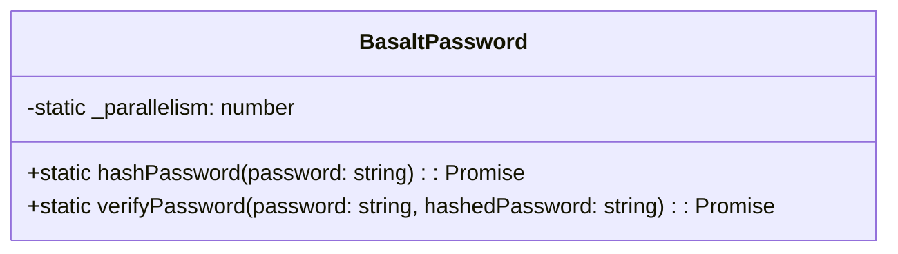

# Class Reference for BasaltPassword

`BasaltPassword` is a utility class providing methods for secure password management. It utilizes Argon2, a password-hashing algorithm, to perform hashing and verification operations.

## Diagram

## Public Methods

### `hashPassword`

???+ info "hashPassword"
    
    - **Description**: Hashes a password using the Argon2 algorithm.
    - **Signature**: `static async hashPassword(password: string): Promise<string>`
    - **Parameters**:
        - `password`: The password to hash.
    - **Returns**: The hashed password as a string.
    - **Exceptions**: Throws an error if the password is empty or if an error occurs during hashing.

### `verifyPassword`

???+ info "verifyPassword"

    - **Description**: Verifies a password against its hashed version.
    - **Signature**: `static async verifyPassword(password: string, hashedPassword: string): Promise<boolean>`
    - **Parameters**:
        - `password`: The plain-text password to verify.
        - `hashedPassword`: The hashed password to verify against.
    - **Returns**: A boolean indicating whether the password is correct.
    - **Exceptions**: Throws an error if the password is empty, if the passwords do not match, or if an error occurs during verification.
