# **📚 Contributing to Basalt Helper**

## **🏗️ Introduction**

If you wish to contribute to **Basalt Helper**, we would be delighted!

The following steps will guide you through the contribution process, helping you understand how you can help the project.

## **🛠️ Bun Setup**

=== "Linux & MacOS"

   ```bash
   curl -fsSL https://bun.sh/install | bash
   ```

=== "Windows"

   ```powershell
   powershell -c "irm bun.sh/install.ps1 | iex"
   ```

You can also visit the [official Bun website](https://bun.sh).

## **🔄 Contribution Process**

```mermaid
gitGraph
   commit
   branch develop
   checkout develop
   branch feature/id
   checkout feature/id
   commit id: "feat(🚀): add some feature"
   commit id: "test(🧪): add some tests"
   checkout develop
   merge feature/id id:"Merge branch 'feature/id' into develop" tag:"v1.0.0-canary-19971212-ee94487"
   checkout main
   merge develop id:"Merge branch 'develop' into main" tag:"v1.0.0"
```



1. **Fork** the project  
   Start by creating a fork of the repository on GitHub. This will help you create your own copy of the project on your account, allowing you to make changes freely.
2. **Create** your feature branch (`git checkout -b feature/AmazingFeature`)  
   Create a new branch to work on your feature from the `develop` branch.
3. **Commit** your changes (`git commit -m 'feat: Add some AmazingFeature'`)  
   Once you have completed your changes, you can commit them and prepare them for pushing.
   Please use [conventional commits](https://www.conventionalcommits.org/en/v1.0.0/) for your commit messages, this will allow automatic generation of version notes in addition to automatic version incrementing.
4. **Push** to the branch (`git push origin feature/AmazingFeature`)  
   Once you have completed your changes, you can push them to your fork.
5. Open a **Pull Request** to the `develop` branch  
   Once you have pushed your changes to your fork, you can open a Pull Request to the main repository's `develop` branch.
6. After your Pull Request is approved, your branch will be **merged** into `develop` and deleted.  
   Once your Pull Request has been approved, your branch will be merged into `develop` and deleted.

!!! warning "Note"
   Make sure to always update your local branch with the `develop` branch before starting work on a new feature to ensure you're working with the latest version of the project.

## **📝 Additional Notes**

Make sure to test all your changes and add tests when possible.

Be open to feedback and suggestions on your pull request.

## **🙏 Acknowledgment**

Thank you sincerely for your interest in contributing to **Basalt Helper**. Your help is greatly appreciated and contributes to the improvement of the project.

<script data-name="BMC-Widget"
   data-cfasync="false"
   src="https://cdnjs.buymeacoffee.com/1.0.0/widget.prod.min.js"
   data-id="necrelox"
   data-description="Support me on Buy me a coffee!"
   data-message="Thank you for your visit!"
   data-color="#5F7FFF"
   data-position="Right"
   data-x_margin="18"
   data-y_margin="22" />

