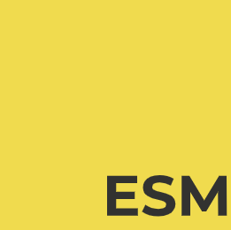

{width="30", loading=lazy, align=right}
{width="30", loading=lazy, align=right}
{width="40", loading=lazy, align=right}


# **[Basalt Helper](https://www.npmjs.com/package/@basalt-lab/basalt-helper)**

!!! warning

    Basalt est mon premier petit projet que je publie. S'il vous plaît, soyez indulgent et n'hésitez pas à me faire un retour sur votre expérience : [basalt-lab@proton.me](mailto:basalt-lab@proton.me) ou via Discord `necrelox`.

## **🏗️ Introduction**

**Basalt Helper** est un package utilitaire sans **aucune dépendance** (*à partir de la version canary*), conçu pour être **léger et performant**.

Il propose plusieurs outils qui se veulent simples d'utilisation et efficaces. Le package continuera d'évoluer avec de nouvelles fonctionnalités, tout en restant minimaliste et facile à adopter pour les développeurs.

## **❓ Pourquoi Basalt Helper ?**

Le choix de **Basalt Helper** s'explique par sa **légèreté**, son **absence de dépendances** et sa **simplicité d'intégration**.

Il a été pensé pour être **rapide, efficace et facile à intégrer** dans n'importe quel projet utilisant **Bun**.

## 📦 Informations du package

Les packages Basalt sont disponibles en deux versions :

- **Stable** : Version par défaut, recommandée pour la production (`@basalt-lab/basalt-helper`)
- **Canary** : Version de développement la plus récente, avec les dernières fonctionnalités (`@basalt-lab/basalt-helper@canary`)

Pour installer une version spécifique, utilisez les tags correspondants lors de l'installation.

| Version | Unpacked Size | Minified Gzipped |
|---------|--------------|------------------|
| [](https://www.npmjs.com/package/@basalt-lab/basalt-helper/v/latest) |  |  |
| [](https://www.npmjs.com/package/@basalt-lab/basalt-helper/v/canary) | &color=darkcyan) | - |

## **⚡ Installation**
Intégrer **Basalt Helper** dans votre projet est un jeu d'enfant.

Package : [@basalt-lab/basalt-helper](https://www.npmjs.com/package/@basalt-lab/basalt-helper)

Suivez ces étapes pour l'ajouter à votre projet :

Bun:
```bash
bun add @basalt-lab/basalt-helper
```
Or canary version
```bash
bun add @basalt-lab/basalt-helper@canary
```

<!-- termynal -->

```bash
$ bun add @basalt-lab/basalt-helper
---> 100%
installed @basalt-lab/basalt-helper@[version]
```

Vous êtes prêt à commencer ! Bon développement 🚀

<script data-name="BMC-Widget"
    data-cfasync="false"
    src="https://cdnjs.buymeacoffee.com/1.0.0/widget.prod.min.js"
    data-id="necrelox"
    data-description="Supportez moi sur Buy me a coffee!"
    data-message="Merci de votre visite!"
    data-color="#5F7FFF"
    data-position="Right"
    data-x_margin="18"
    data-y_margin="22" />
