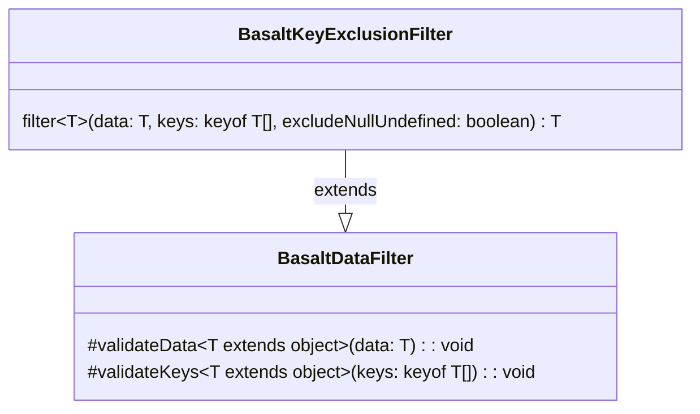

## **BasaltKeyExclusionFilter Class Reference**

`BasaltKeyExclusionFilter` extends the functionality of `BasaltDataFilter` by providing a method to specifically exclude defined keys from a data object.

## **Diagram**

## **Public Methods**

Below are the technical details of each available public method.

### `filter`

???+ info "filter"

    - **Description**: Excludes specified keys from the provided data object. Creates a new object that contains all properties from the original data object except for those keys that are provided for exclusion. It can also exclude properties with null or undefined values if the `excludeNullUndefined` flag is set to true.
    - **Signature**: `public filter<T extends object>(data: T, keys: (keyof T)[], excludeNullUndefined: boolean = false): T`
    - **Parameters**:
        - `data`: The data object to filter.
        - `keys`: An array of keys to exclude from the data object.
        - `excludeNullUndefined` (optional): A flag to determine whether properties with null or undefined values should be excluded. Defaults to false.
    - **Returns**: The filtered data object with the specified keys excluded.
    - **Exceptions**: Throws an error if the data object is null, if the array of keys to exclude is empty, or if keys are not an array, etc.
