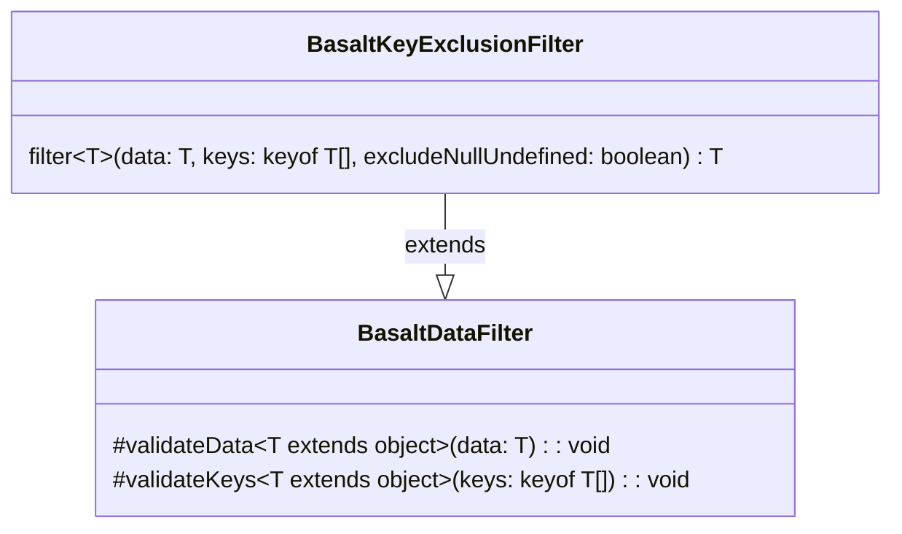

## **Référence de la classe BasaltKeyExclusionFilter**

`BasaltKeyExclusionFilter` étend la fonctionnalité de `BasaltDataFilter` pour fournir une méthode permettant d'exclure spécifiquement les clés définies d'un objet de données

## **Diagramme**

## **Méthodes publiques**

Ci-dessous, vous trouverez les détails techniques de chaque méthode publique disponible.

### `filter`

???+ info "filter"

    - **Description** : Exclut les clés spécifiées de l'objet de données fourni. Crée un nouvel objet qui contient toutes les propriétés de l'objet de données original, sauf celles dont les clés sont fournies pour exclusion. Il peut également exclure les propriétés dont les valeurs sont null ou undefined si l'indicateur `excludeNullUndefined` est défini sur true.
    - **Signature** : `public filter<T extends object>(data: T, keys: (keyof T)[], excludeNullUndefined: boolean = false): T`
    - **Paramètres** :
        - `data` : L'objet de données à filtrer.
        - `keys` : Un tableau des clés à exclure de l'objet de données.
        - `excludeNullUndefined` (facultatif) : Un drapeau pour déterminer si les propriétés avec des valeurs null ou undefined doivent être exclues. Par défaut, il est réglé sur false.
    - **Renvoie** : L'objet de données filtré avec les clés spécifiées exclues.
    - **Exceptions** : Lance une erreur si l'objet de données est nul, si l'array des clés est vide, ou si les clés ne sont pas un tableau, etc.
