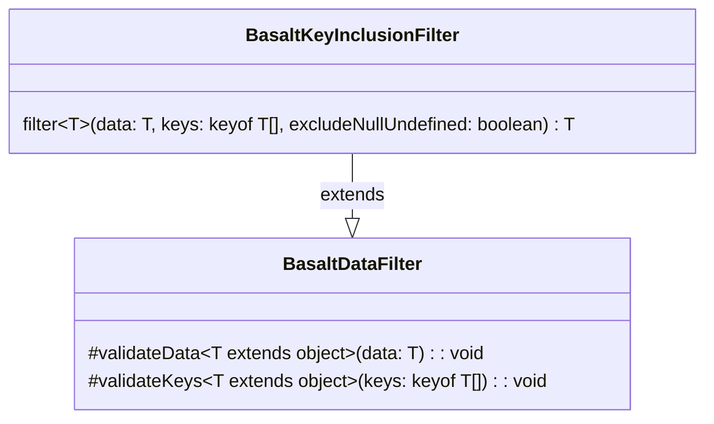

## **BasaltKeyInclusionFilter Class Reference**

`BasaltKeyInclusionFilter` extends the functionality of `BasaltDataFilter` by providing a method to only include specified keys in a data object.

## **Diagram**

## **Public Methods**

Below are the public methods for the `BasaltKeyInclusionFilter` class.

### `filter`

???+ info "filter"

    - **Description**: Filters the provided data by including only the specified keys. The resulting object will only contain properties that match the keys provided. Properties with null or undefined values can optionally be excluded based on the `excludeNullUndefined` flag.
    - **Signature**: `public filter<T extends object>(data: T, keys: (keyof T)[], excludeNullUndefined: boolean = false): T`
    - **Parameters**:
        - `data`: The data object to filter.
        - `keys`: An array of keys to include in the resulting data object.
        - `excludeNullUndefined` (optional): A flag to determine if properties with null or undefined values should be excluded. Defaults to false.
    - **Returns**: The filtered data object with only the specified keys included.
    - **Exceptions**: Throws an error if the data object is null, if the array of keys to include is empty, or if the keys are not an array, etc.
