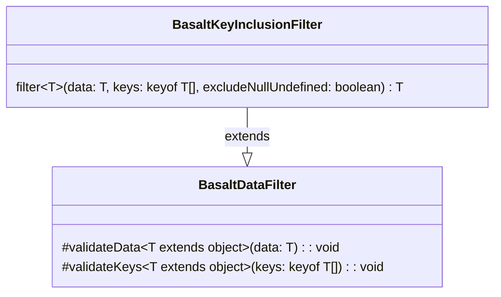

## **Référence de la classe BasaltKeyInclusionFilter**

`BasaltKeyInclusionFilter` étend les fonctionnalités de `BasaltDataFilter` en fournissant une méthode pour inclure uniquement les clés spécifiées dans un objet de données.

## **Diagramme**

## **Méthodes publiques**

Ci-dessous, vous trouverez les détails techniques de chaque méthode publique disponible.

### `filter`

???+ info "filter"

    - **Description** : Filtre les données fournies en incluant uniquement les clés spécifiées. L'objet résultant ne contiendra que les propriétés qui correspondent aux clés fournies. Les propriétés ayant des valeurs null ou indéfinies peuvent éventuellement être exclues en fonction du drapeau `excludeNullUndefined`.
    - **Signature** : `public filter<T extends object>(data: T, keys: (keyof T)[], excludeNullUndefined: boolean = false): T`
    - **Paramètres** :
        - `data` : L'objet de données à filtrer.
        - `keys` : Un tableau des clés à inclure dans l'objet de données résultant.
        - `excludeNullUndefined` (optionnel) : Un drapeau pour déterminer si les propriétés ayant des valeurs null ou indéfinies doivent être exclues. Par défaut à false.
    - **Retourne** : L'objet de données filtré avec uniquement les clés spécifiées incluses.
    - **Exceptions** : Lance une erreur si l'objet de données est null, si le tableau des clés à inclure est vide, ou si les clés ne sont pas un tableau, etc.

