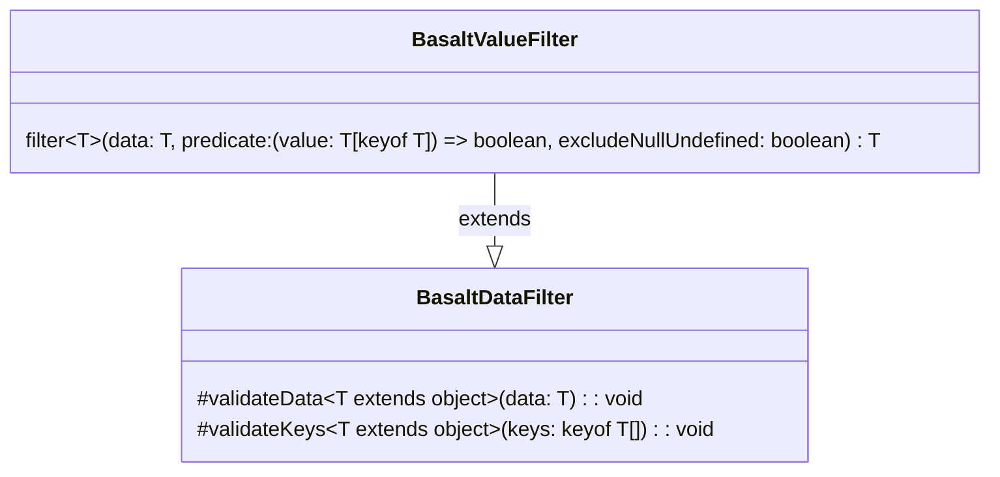

## **BasaltValueFilter Class Reference**

`BasaltValueFilter` extends the functionality of `BasaltDataFilter` by providing a method to filter data based on value criteria defined by a predicate function.

## **Diagram**

## **Public Methods**

Below are the technical details of each public method available.

### `filter`

???+ info "filter"

    - **Description**: Filters the provided data based on a predicate applied to its values. The resulting object will only include properties whose values satisfy the predicate function. Properties with null or undefined values can optionally be excluded based on the `excludeNullUndefined` flag.
    - **Signature**: `public filter<T extends object> (data: T, predicate: (value: T[keyof T]) => boolean, excludeNullUndefined: boolean = false): T`
    - **Parameters**:
        - `data`: The data object to be filtered.
        - `predicate`: The predicate function to apply to the values.
        - `excludeNullUndefined` (optional): Flag to determine if properties with null or undefined values should be excluded. Defaults to false.
    - **Returns**: The filtered data object with properties satisfying the predicate.
    - **Exceptions**: Throws an error if the data object is null, if the predicate function is not valid, etc.
