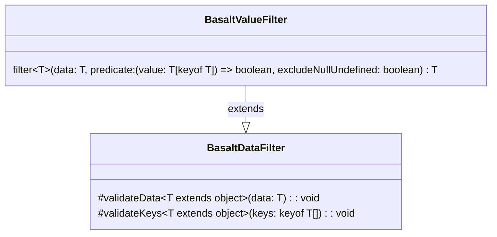

## **Référence de la classe BasaltValueFilter**

`BasaltValueFilter` étend la fonctionnalité de `BasaltDataFilter` en fournissant une méthode pour filtrer les données basées sur des critères de valeur définis par une fonction prédicat.

## **Diagramme**

## **Méthodes publiques**

Ci-dessous, vous trouverez les détails techniques de chaque méthode publique disponible.

### `filter`

???+ info "filter"

    - **Description** : Filtre les données fournies en se basant sur un prédicat appliqué à ses valeurs. L'objet résultant inclura seulement les propriétés dont les valeurs satisfont la fonction prédicat. Les propriétés avec des valeurs null ou undefined peuvent être exclues en option, basé sur le drapeau `excludeNullUndefined`.
    - **Signature** : `public filter<T extends object> (data: T, predicate: (value: T[keyof T]) => boolean, excludeNullUndefined: boolean = false): T`
    - **Paramètres** :
        - `data` : L'objet de données à filtrer.
        - `predicate` : La fonction prédicat à appliquer aux valeurs.
        - `excludeNullUndefined` (optionnel) : Drapeau pour déterminer si les propriétés avec des valeurs null ou undefined doivent être exclues. Par défaut à false.
    - **Renvoie** : L'objet de données filtré avec les propriétés satisfaisant le prédicat.
    - **Exceptions** : Lance une erreur si l'objet de données est null, si la fonction prédicat n'est pas valide, etc.
