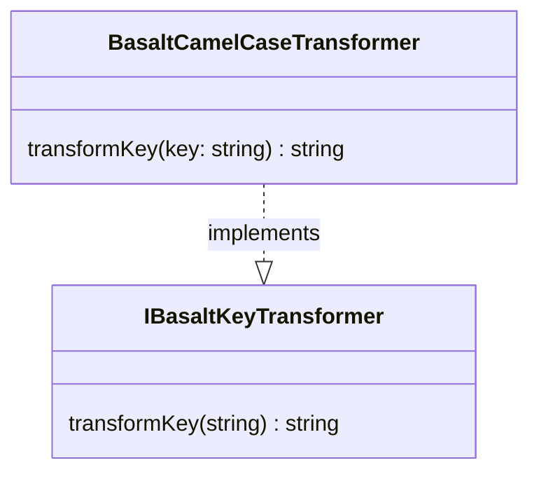

## **BasaltCamelCaseTransformer Class Reference**

`BasaltCamelCaseTransformer` is a class that implements the `IBasaltKeyTransformer` interface to transform string keys into the camelCase format.

## **Diagram**



## **Public Method**

Below are the technical details of each public method available.

### `transformKey`

???+ info "transformKey"

    - **Description**: Converts a string key from any case to camelCase.
    - **Signature**: `public transformKey(key: string): string`
    - **Parameters**:
        - `key`: The string of the key to be transformed into camelCase.
    - **Returns**: The camelCase transformed string of the key.
    - **Examples**:
        ```javascript
        // returns "myKeyName"
        transformKey('MyKeyName');
        // returns "myKeyName"
        transformKey('my-key-name');
        // returns "myKeyName"
        transformKey('my_key_name');
        ```
