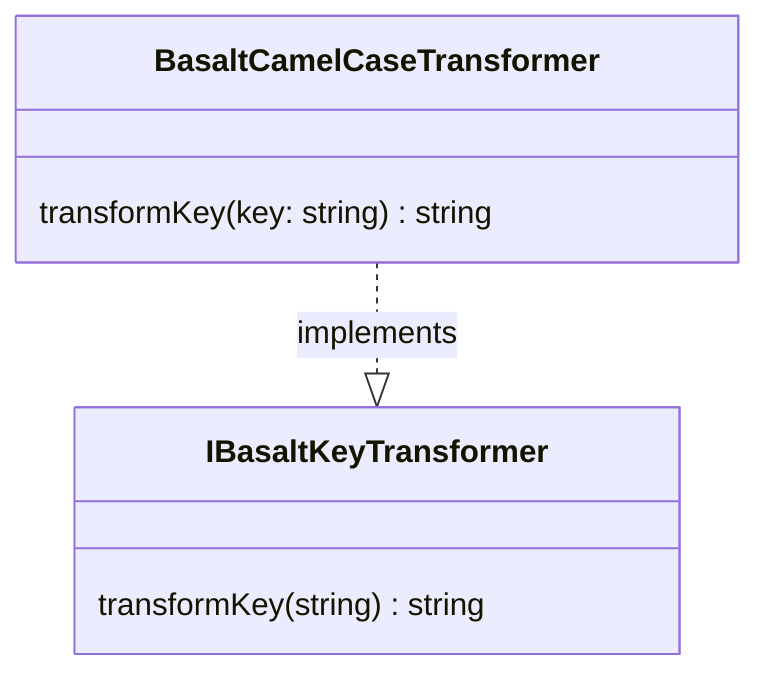

## **Référence de la Classe BasaltCamelCaseTransformer**

`BasaltCamelCaseTransformer` est une classe qui implémente l'interface `IBasaltKeyTransformer` pour transformer des clés sous forme de chaînes de caractères dans le format camelCase.

## **Diagramme**



## **Méthodes publiques**

Ci-dessous, vous trouverez les détails techniques de chaque méthode publique disponible.

### `transformKey`

???+ info "transformKey"

    - **Description** : Transforme une clé en chaîne de caractères de n'importe quelle casse en format camelCase.
    - **Signature** : `public transformKey(key: string): string`
    - **Paramètres** :
        - `key` : La chaîne de caractères de la clé à transformer en camelCase.
    - **Retourne** : La chaîne de caractères de la clé transformée en camelCase.
    - **Exemples** :
        ```javascript
        // retourne "myKeyName"
        transformKey('MyKeyName');
        // retourne "myKeyName"
        transformKey('my-key-name');
        // retourne "myKeyName"
        transformKey('my_key_name');
        ```
