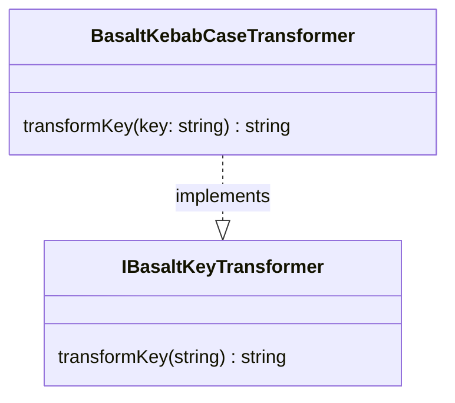

## **BasaltKebabCaseTransformer Class Reference**

`BasaltKebabCaseTransformer` est une classe qui implémente l'interface `IBasaltKeyTransformer` pour transformer des clés de chaîne de caractères au format kebab-case.

## **Diagram**



## **Public Method**

Below are the technical details of each public method available.

### `transformKey`

???+ info "transformKey"

    - **Description**: Transforms a single key from any case to kebab-case.
    - **Signature**: `public transformKey(key: string): string`
    - **Parameters**:
        - `key`: The key string to be transformed into kebab-case.
    - **Returns**: The key string transformed into kebab-case, with all letters in lower case and words separated by hyphens.
    - **Examples**:
        ```javascript
        // returns "my-key-name"
        transformKey('myKeyName');
        // returns "my-key-name"
        transformKey('MyKeyName');
        // returns "my-long-key-name"
        transformKey('myLongKeyName');
        ```
