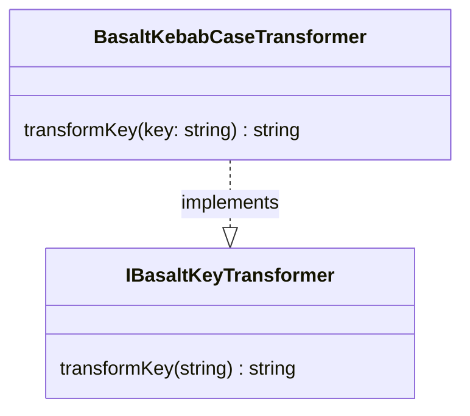

## **Référence de la classe BasaltKebabCaseTransformer**

`BasaltKebabCaseTransformer` est une classe qui implémente l'interface `IBasaltKeyTransformer` pour transformer des clés de chaîne de caractères au format kebab-case.

## **Diagramme**



## **Méthode publique**

Ci-dessous, vous trouverez les détails techniques de chaque méthode publique disponible.

### `transformKey`

???+ info "transformKey"

    - **Description** : Transforme une clé unique de n'importe quelle casse en kebab-case.
    - **Signature** : `public transformKey(key: string): string`
    - **Paramètres** :
        - `key` : La chaîne de caractères de la clé à transformer en kebab-case.
    - **Renvoie** : La chaîne de la clé transformée en kebab-case, avec toutes les lettres en minuscule et les mots séparés par des tirets.
    - **Exemples** :
        ```javascript
        // renvoie "my-key-name"
        transformKey('myKeyName');
        // renvoie "my-key-name"
        transformKey('MyKeyName');
        // renvoie "my-long-key-name"
        transformKey('myLongKeyName');
        ```
