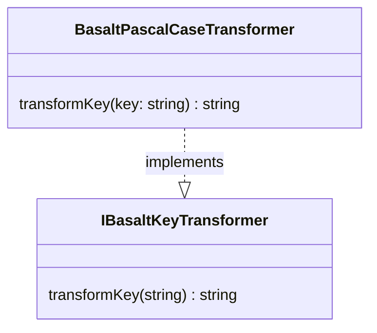

## **BasaltPascalCaseTransformer Class Reference**

`BasaltPascalCaseTransformer` is a class implementing the `IBasaltKeyTransformer` interface to transform string keys into PascalCase format.

## **Diagram**



## **Public Method**

Below are the technical details of each public method available.

### `transformKey`

???+ info "transformKey"

    - **Description**: Transforms a single key from any case to PascalCase.
    - **Signature**: `public transformKey(key: string): string`
    - **Parameters**:
        - `key`: The string key to be transformed into PascalCase.
    - **Returns**: The key string transformed into PascalCase, with the first letter of each word capitalized.
    - **Examples**:
        ```javascript
        // returns "MyKeyName"
        transformKey('my_key_name');
        // returns "MyKeyName"
        transformKey('my-key-name');
        // returns "MyLongKeyName"
        transformKey('myLongKeyName');
        ```
