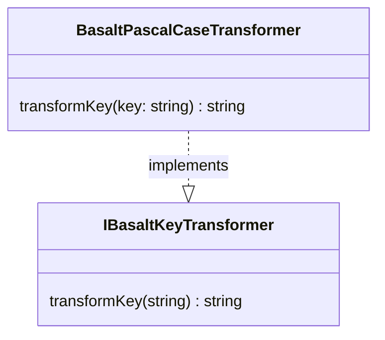

## **Référence de la classe BasaltPascalCaseTransformer**

`BasaltPascalCaseTransformer` est une classe qui implémente l'interface `IBasaltKeyTransformer` pour transformer des chaînes de caractères (clés) au format PascalCase.

## **Diagramme**



## **Méthode publique**

Ci-dessous, vous trouverez les détails techniques de chaque méthode publique disponible.

### `transformKey`

???+ info "transformKey"

    - **Description** : Transforme une clé unique de n'importe quel format en PascalCase.
    - **Signature** : `public transformKey(key: string): string`
    - **Paramètres** :
        - `key` : La chaîne de caractères (clé) à transformer en PascalCase.
    - **Renvoie** : La chaîne de caractères (clé) transformée en PascalCase, avec la première lettre de chaque mot en majuscule.
    - **Exemples** :
        ```javascript
        // renvoie "MyKeyName"
        transformKey('my_key_name');
        // renvoie "MyKeyName"
        transformKey('my-key-name');
        // renvoie "MyLongKeyName"
        transformKey('myLongKeyName');
        ```
