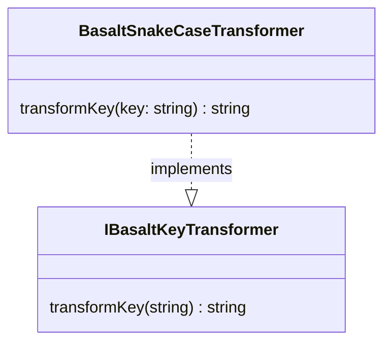

## **BasaltSnakeCaseTransformer Class Reference**

`BasaltSnakeCaseTransformer` is a class that implements the `IBasaltKeyTransformer` interface to transform string keys into the snake_case format.

## **Diagram**



## **Public Method**

Below are the technical details of each public method available.

### `transformKey`

???+ info "transformKey"

    - **Description**: Transforms a single key from any string case to snake_case.
    - **Signature**: `public transformKey(key: string): string`
    - **Parameters**:
        - `key`: The key string to be transformed into snake_case.
    - **Returns**: The transformed key string in snake_case, with underscores separating words.
    - **Examples**:
        ```javascript
        // returns "my_key_name"
        transformKey('myKeyName');
        // returns "my_key_name"
        transformKey('MyKeyName');
        // returns "my_key_name"
        transformKey('My-Key-Name');
        // returns "my_key_name"
        transformKey('my key name');
        ```
