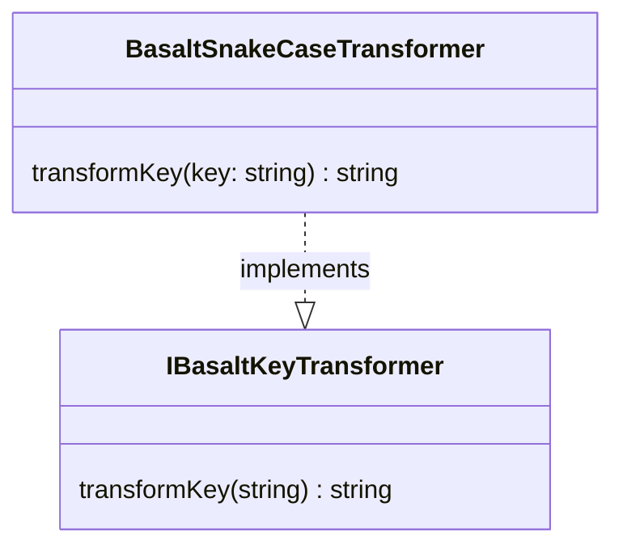

## **Référence de la Classe BasaltSnakeCaseTransformer**

`BasaltSnakeCaseTransformer` est une classe qui implémente l'interface `IBasaltKeyTransformer` pour transformer des clés sous forme de chaînes de caractères en format snake_case.

## **Diagramme**



## **Méthode Publique**

Ci-dessous, vous trouverez les détails techniques de chaque méthode publique disponible.

### `transformKey`

???+ info "transformKey"

    - **Description** : Convertit une clé sous forme de chaîne de caractères de n'importe quelle casse en snake_case.
    - **Signature** : `public transformKey(key: string): string`
    - **Paramètres** :
        - `key` : La chaîne de caractères de la clé à transformer en snake_case.
    - **Retour** : La chaîne de caractères de la clé transformée en snake_case, avec des tirets bas entre les mots.
    - **Exemples** :
        ```javascript
        // retourne "my_key_name"
        transformKey('myKeyName');
        // retourne "my_key_name"
        transformKey('MyKeyName');
        // retourne "my_key_name"
        transformKey('My-Key-Name');
        // retourne "my_key_name"
        transformKey('my key name');
        ```
