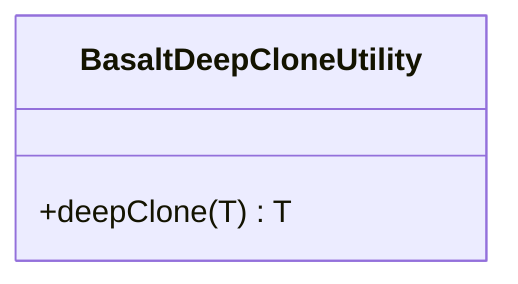

## **BasaltDeepCloneUtility Class Reference**

The `BasaltDeepCloneUtility` is a utility class for deep cloning objects.

## **Diagram**



## **Public Method**

Below are the technical details of each public method available.

### `deepClone`

???+ info "deepClone"

    - **Description**: Creates a deep clone of the provided data object.
    - **Signature**: `public static deepClone<T>(data: T): T`
    - **Parameters**:
        - `data`: The data object to be cloned.
    - **Returns**: The deeply cloned object.
    - **Exceptions**: Throws an error if the data is null or undefined.
    - **Examples**:
        ```javascript
        // Returns a new Date object with the same time value
        deepClone(new Date());
        
        // Returns a new RegExp based on the original
        deepClone(new RegExp('abc'));
        
        // Returns a new array where each element is a deep clone
        deepClone([1, [2, 3], { a: 'b' }]);
        
        // Returns a new object with deeply cloned properties
        deepClone({ x: { y: { z: 1 } } });
        ```
