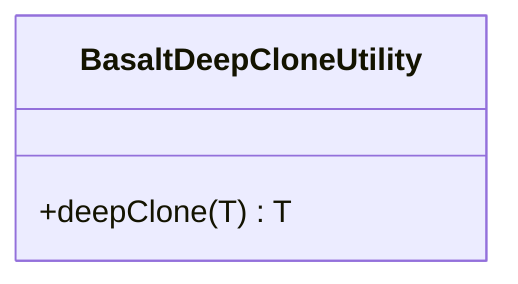

## **Référence de la classe BasaltDeepCloneUtility**

`BasaltDeepCloneUtility` est une classe utilitaire pour le clonage profond d'objets.

## **Diagramme**



## **Méthodes publiques**

Ci-dessous, vous trouverez les détails techniques de chaque méthode publique disponible.

### `deepClone`

???+ info "deepClone"

    - **Description** : Crée un clone profond de l'objet de données fourni.
    - **Signature** : `public static deepClone<T>(data: T): T`
    - **Paramètres** :
        - `data` : L'objet de données à cloner.
    - **Renvoie** : L'objet cloné en profondeur.
    - **Exceptions** : Lance une erreur si les données sont nulles ou non définies.
    - **Exemples** :
        ```javascript
        // Renvoie un nouvel objet Date avec la même valeur de temps
        deepClone(new Date());
        
        // Renvoie une nouvelle expression régulière basée sur l'originale
        deepClone(new RegExp('abc'));
        
        // Renvoie un nouveau tableau dont les éléments sont des clones profonds
        deepClone([1, [2, 3], { a: 'b' }]);
        
        // Renvoie un nouvel objet avec des propriétés clonées en profondeur
        deepClone({ x: { y: { z: 1 } } });
        ```
