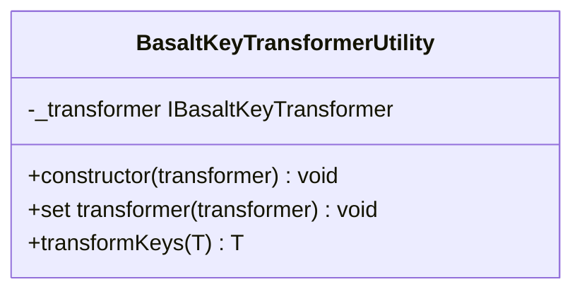

## **BasaltKeyTransformerUtility Class Reference**

La `BasaltKeyTransformerUtility` est une classe utilitaire servant à transformer les clés d'un objet en fonction d'une stratégie de transformation de clés spécifiée.

## **Diagram**



## **Public Method**

Below are the technical details of each public method available.

### `constructor`

???+ info "constructor"

    - **Description**: Constructs a new instance of the `BasaltKeyTransformerUtility` class with a given transformer.
    - **Signature**: `constructor(transformer: IBasaltKeyTransformer)`
    - **Parameters**:
        - `transformer`: An instance of a class that implements the `IBasaltKeyTransformer` interface.

### `transformer (setter)`

???+ info "transformer (setter)"

    - **Description**: Sets a new transformer strategy for key transformation.
    - **Signature**: `set transformer(transformer: IBasaltKeyTransformer)`
    - **Parameters**:
        - `transformer`: An instance of a class that implements the `IBasaltKeyTransformer` interface.

### `transformKeys`

???+ info "transformKeys"

    - **Description**: Transforms the keys of the given object using the current transformation strategy.
    - **Signature**: `public transformKeys<T extends object>(data: T): T`
    - **Parameters**:
        - `data`: The object whose keys are to be transformed.
    - **Returns**: A new object with transformed keys.
    - **Exceptions**: Throws an error if the provided data object is null or undefined. Also throws an error if the data object is not a plain object.
    - **Examples**:
        ```javascript
        // returns { myKey: "value" }
        transformKeys({ "my-key": "value" });
        ```

