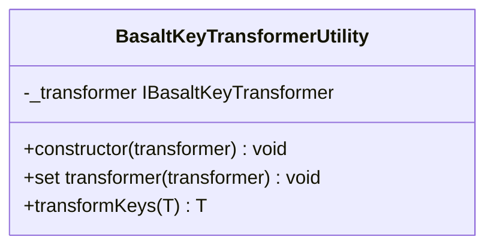

## **Référence de la classe BasaltKeyTransformerUtility**

La `BasaltKeyTransformerUtility` est une classe utilitaire servant à transformer les clés d'un objet en fonction d'une stratégie de transformation de clés spécifiée.

## **Diagramme**



## **Méthodes publiques**

Ci-dessous, vous trouverez les détails techniques de chaque méthode publique disponible.

### `constructor`

???+ info "constructor"

    - **Description** : Crée une nouvelle instance de `BasaltKeyTransformerUtility`.
    - **Signature** : `constructor(transformer: IBasaltKeyTransformer)`
    - **Paramètres** :
        - `transformer` : La stratégie de transformation de clés à utiliser.
    - **Exceptions** : Lance une erreur si la stratégie de transformation de clés est nulle ou non définie.

### `transformer (setter)`

???+ info "transformer (setter)"

    - **Description**: Définit une nouvelle stratégie de transformation pour les clés.
    - **Signature**: `set transformer(transformer: IBasaltKeyTransformer)`
    - **Paramètres**:
        - `transformer`: Une instance d'une classe qui implémente l'interface `IBasaltKeyTransformer`.

### `transformKeys`

???+ info "transformKeys"

    - **Description**: Transforme les clés de l'objet donné en utilisant la stratégie de transformation actuelle.
    - **Signature**: `public transformKeys<T extends object>(data: T): T`
    - **Paramètres**:
        - `data`: L'objet dont les clés doivent être transformées.
    - **Retourne**: Un nouvel objet avec les clés transformées.
    - **Exceptions**: Lève une erreur si l'objet de données fourni est nul ou indéfini. Lève également une erreur si l'objet de données n'est pas un objet simple.
    - **Exemples**:
        ```javascript
        // retourne { myKey: "valeur" }
        transformKeys({ "my-key": "valeur" });
        ```

