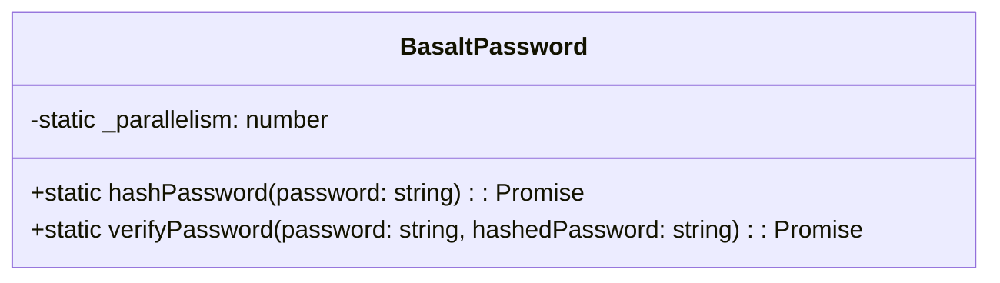

# **Référence de la classe BasaltPassword**

'BasaltPassword' est une classe utilitaire offrant des méthodes pour la gestion sécurisée des mots de passe. Elle utilise Argon2, un algorithme de hachage de mots de passe, pour effectuer des opérations de hachage et de vérification.

## **Diagramme**

## **Méthodes publiques**

Ci-dessous, vous trouverez les détails techniques de chaque méthode publique disponible.

### `hashPassword`

???+ info "hashPassword"

    - **Description** : Hache un mot de passe en utilisant l'algorithme Argon2.
    - **Signature** : 'static async hashPassword(password: string): Promise<string>'
    - **Paramètres** :
        - `password` : Le mot de passe à hacher.
    - **Retour** : Le mot de passe haché sous forme de chaîne de caractères.
    - **Exceptions** : Lance une erreur si le mot de passe est vide ou si un problème est survenu lors du hachage.

### `verifyPassword`

???+ info "verifyPassword"
    
    - **Description** : Vérifie un mot de passe par rapport à sa version hachée.
    - **Signature** : 'static async verifyPassword(password: string, hashedPassword: string): Promise<boolean>'
    - **Paramètres** :
        - `password` : Le mot de passe en clair à vérifier.
        - `hashedPassword` : Le mot de passe haché pour la vérification.
    - **Retour** : Un booléen indiquant si le mot de passe est correct.
    - **Exceptions** : Lance une erreur si le mot de passe est vide, si les mots de passe ne correspondent pas, ou si un problème survient lors de la vérification.
