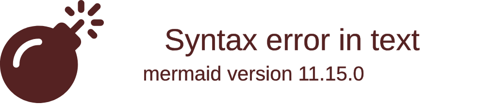

# **Contribuer à Basalt Logger**

## **Introduction**

Si vous souhaiter contribuer à **Basalt Logger**, ce serait avec plaisir !

Les étapes suivantes vous guideront à travers le processus de contribution, en vous aidant à comprendre comment vous pouvez apporter votre aide au projet.

## **Processus de contribution**

1. **Fork** le projet  
   Commencez par créer un fork du dépôt sur GitHub. Cela vous aidera à créer votre propre copie du projet sur votre compte, vous permettant d'y apporter des modifications librement.
2. **Créez** votre branche de fonctionnalité (`git checkout -b feature/AmazingFeature`)  
    Créez une nouvelle branche pour travailler sur votre fonctionnalité à partir de la branche `develop`.
3. **Committez** vos changements (`git commit -m 'feat: Add some AmazingFeature'`)  
    Une fois que vous avez terminé vos modifications, vous pouvez les commiter et les préparer pour le push.
    Veuillez utiliser des [conventionnal commits](https://www.conventionalcommits.org/en/v1.0.0/) pour vos messages de commit, cela permettra de générer automatiquement les notes de version.
4. **Push** vers la branche (`git push origin feature/AmazingFeature`)  
    Une fois que vous avez terminé vos modifications, vous pouvez les pousser vers votre fork.
5. Ouvrez une **Pull Request** vers la branche `develop`  
    Une fois que vous avez poussé vos modifications vers votre fork, vous pouvez ouvrir une Pull Request vers la branche `develop` du dépôt principal.
6. Après la validation de votre Pull Request, votre branche sera **fusionnée** dans `develop` et supprimée.  
    Une fois que votre Pull Request a été validée, votre branche sera fusionnée dans `develop` et supprimée.

!!! warning "Note"
    Assurez-vous de toujours mettre à jour votre branche locale avec la branche `develop` avant de commencer à travailler sur une nouvelle fonctionnalité pour vous assurer que vous travaillez avec la dernière version du projet.

## **Notes supplémentaires**

Assurez-vous de tester toutes vos modifications et d'ajouter des tests lorsque cela est possible.  

Soyez ouvert aux retours et aux suggestions sur votre pull request.

## **Remerciement**

Je vous remercie sincèrement pour votre intérêt à contribuer à **Basalt Logger**. Votre aide est grandement appréciée et contribue à l'amélioration du projet.

<script data-name="BMC-Widget"
    data-cfasync="false"
    src="https://cdnjs.buymeacoffee.com/1.0.0/widget.prod.min.js"
    data-id="necrelox"
    data-description="Support me on Buy me a coffee!"
    data-message="Merci de votre visite!"
    data-color="#5F7FFF"
    data-position="Right"
    data-x_margin="18"
    data-y_margin="22" />
