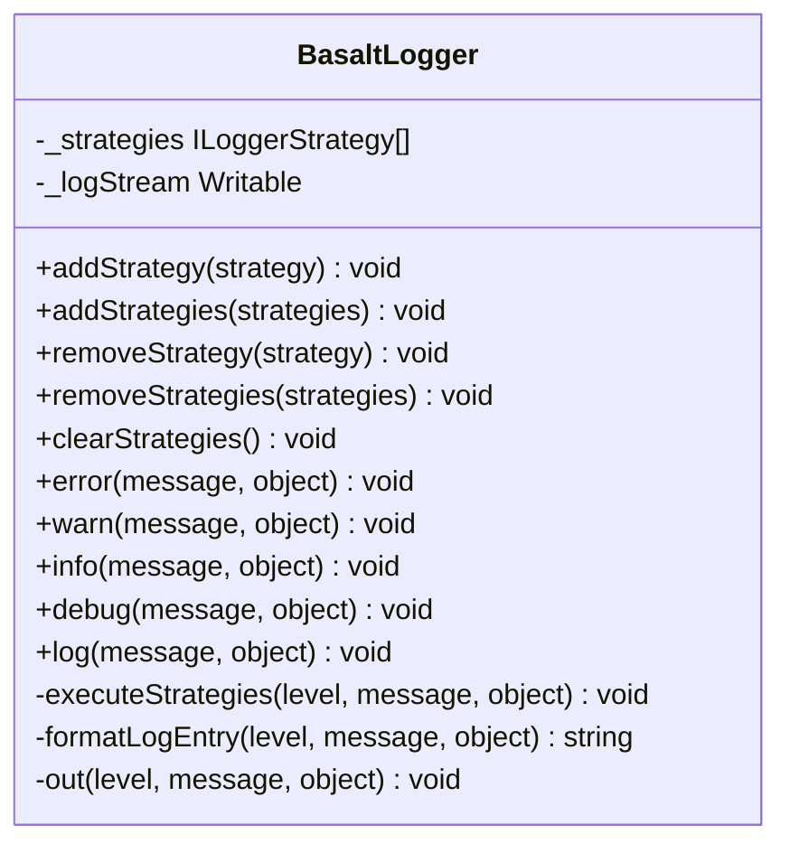

## **BasaltLogger Class Reference**

`BasaltLogger` provides a flexible non-blocking logging system, which allows multiple strategies for log output.

## **Diagram**

## **Public Methods**

Below are the technical details of each available public method.

### `addStrategy`

???+ info "addStrategy"

    - **Description**: Adds a logging strategy to the logger.
    - **Signature**: `public static addStrategy(strategy: ILoggerStrategy): void`
    - **Parameters**:
        - `strategy`: The logging strategy to add.
    - **Exceptions**: Throws a `BasaltLoggerError` if the strategy is already added.

### `addStrategies`

???+ info "addStrategies"

    - **Description**: Adds multiple logging strategies to the logger.
    - **Signature**: `public static addStrategies(strategies: ILoggerStrategy[]): void`
    - **Parameters**:
        - `strategies`: An array of logging strategies to add.
    - **Exceptions**: Throws a `BasaltLoggerError` if any of the strategies are already added.

### `removeStrategy`

???+ info "removeStrategy"

    - **Description**: Removes a logging strategy from the logger.
    - **Signature**: `public static removeStrategy(strategy: ILoggerStrategy): void`
    - **Parameters**:
        - `strategy`: The logging strategy to remove.
    - **Exceptions**: Throws a `BasaltLoggerError` if the strategy is not found.

### `removeStrategies`

???+ info "removeStrategies"

    - **Description**: Removes multiple logging strategies from the logger.
    - **Signature**: `public static removeStrategies(strategies: ILoggerStrategy[]): void`
    - **Parameters**:
        - `strategies`: An array of logging strategies to remove.

### `clearStrategies`

???+ info "clearStrategies"

    - **Description**: Clears all logging strategies from the logger.
    - **Signature**: `public static clearStrategies(): void`

### `log`

???+ info "log"

    - **Description** : Methods for logging messages.
    - **Signature** : `public static log(message: string, object?: unknown): void` (similar for `warn`, `info`, `debug`, `error`)
    - **Paramètres** :
        - `message` : The message to log.
        - `object` (optional): Additional information to log.
    - **Exceptions** : Throws a `BasaltLoggerError` if no strategies are added.

### `info`

???+ info "info"

    - **Description** : Methods for logging messages.
    - **Signature** : `public static info(message: string, object?: unknown): void` (similar for `warn`, `error`, `debug`, `log`)
    - **Parameters** :
        - `message` : The message to log.
        - `object` (optional): Additional information to log.
    - **Exceptions** : Throws a `BasaltLoggerError` if no strategies are added.

### `debug`

???+ info "debug"

    - **Description** : Methods for logging messages.
    - **Signature** : `public static debug(message: string, object?: unknown): void` (similar for `warn`, `info`, `error`, `log`)
    - **Parameters** :
        - `message` : The message to log.
        - `object` (optional): Additional information to log.
    - **Exceptions** : Throws a `BasaltLoggerError` if no strategies are added.

### `warn`

???+ info "warn"

    - **Description** : Methods for logging messages.
    - **Signature** : `public static warn(message: string, object?: unknown): void` (similar for `error`, `info`, `debug`, `log`)
    - **Parameters** :
        - `message` : The message to log.
        - `object` (optional): Additional information to log.
    - **Exceptions** : Throws a `BasaltLoggerError` if no strategies are added.

### `error`

???+ info "error"

    - **Description** : Methods for logging messages.
    - **Signature** : `public static error(message: string, object?: unknown): void` (similar for `warn`, `info`, `debug`, `log`)
    - **Parameters** :
        - `message` : The message to log.
        - `object` (optional): Additional information to log.
    - **Exceptions** : Throws a `BasaltLoggerError` if no strategies are added.

