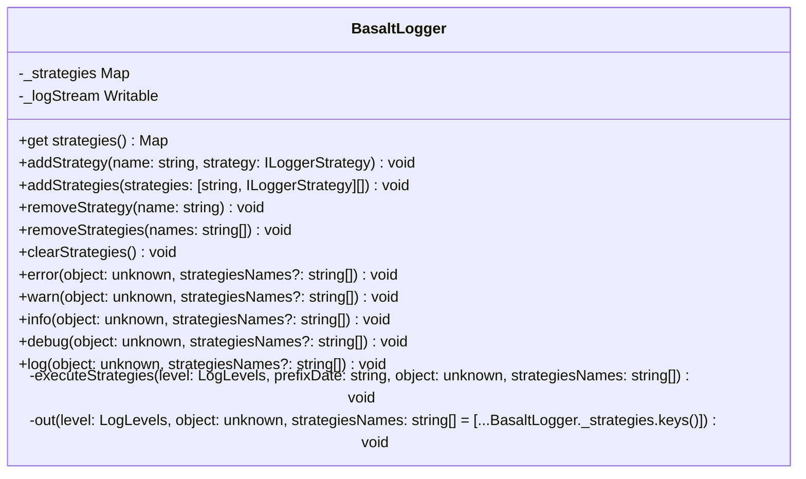

## **BasaltLogger Class Reference**

`BasaltLogger` provides a flexible non-blocking logging system, which allows multiple strategies for log output.

## **Diagram**

## **Public Methods**

Below are the technical details of each available public method.

### `get strategies`

???+ info "get strategies"

    - **Description** : Returns the logging strategies.
    - **Signature** : `public static get strategies(): Map<string, ILoggerStrategy>`

### `addStrategy`

???+ info "addStrategy"

    - **Description** : Adds one logging strategy.
    - **Signature** :
        - `public static addStrategy(name: string, strategy: ILoggerStrategy): void`
    - **Parameters** :
        - `name` : The name of the strategy.
        - `strategy` : The logging strategy to add.
    - **Exceptions** : Throws a `BasaltLoggerError` if a strategy with the same name already exists.

### `addStrategies`

???+ info "addStrategies"

    - **Description** : Adds multiple logging strategies.
    - **Signature** :
        - `public static addStrategies(strategies: [string, ILoggerStrategy][]): void`
    - **Parameters** :
        - `strategies` : An array of strategies.
    - **Exceptions** : Throws a `BasaltLoggerError` if a strategy with the same name already exists.

### `removeStrategy`

???+ info "removeStrategy"

    - **Description** : Removes one logging strategy.
    - **Signature** :
        - `public static removeStrategy(name: string): void`
    - **Parameters** :
        - `name` : The name of the strategy to remove.
    - **Exceptions** : Throws a `BasaltLoggerError` if the strategy is not found.

### `removeStrategies`

???+ info "removeStrategies"

    - **Description** : Removes multiple logging strategies.
    - **Signature** :
        - `public static removeStrategies(names: string[]): void`
    - **Parameters** :
        - `names` : An array of strategy names to remove.
    - **Exceptions** : Throws a `BasaltLoggerError` if the strategy is not found.

### `clearStrategies`

???+ info "clearStrategies"

    - **Description** : Removes all logging strategies.
    - **Signature** : `public static clearStrategies(): void`

### `log`

???+ info "log"

    - **Description** : Methods to log messages of different severity levels.
    - **Signature** : `public static log(message: string, strategiesNames: string[] = [...BasaltLogger._strategies.keys()]): void`
    - **Parameters** :
        - `object` : The object to log.
        - `strategiesNames` : The names of the strategies to use.
    - **Exceptions** : Throws a `BasaltLoggerError` if no strategy is added.

### `info`

???+ info "info"

    - **Description** : Methods to log messages of different severity levels.
    - **Signature** : `public static info(message: string, strategiesNames: string[] = [...BasaltLogger._strategies.keys()]): void`
    - **Parameters** :
        - `object` : The object to log.
        - `strategiesNames` : The names of the strategies to use.
    - **Exceptions** : Throws a `BasaltLoggerError` if no strategy is added.

### `debug`

???+ info "debug"

    - **Description** : Methods to log messages of different severity levels.
    - **Signature** : `public static debug(message: string, strategiesNames: string[] = [...BasaltLogger._strategies.keys()]): void`
    - **Parameters** :
        - `object` : The object to log.
        - `strategiesNames` : The names of the strategies to use.
    - **Exceptions** : Throws a `BasaltLoggerError` if no strategy is added.

### `warn`

???+ info "warn"

    - **Description** : Methods to log messages of different severity levels.
    - **Signature** : `public static warn(message: string, strategiesNames: string[] = [...BasaltLogger._strategies.keys()]): void`
    - **Parameters** :
        - `object` : The object to log.
        - `strategiesNames` : The names of the strategies to use.
    - **Exceptions** : Throws a `BasaltLoggerError` if no strategy is added.

### `error`

???+ info "error"

    - **Description** : Methods to log messages of different severity levels.
    - **Signature** : `public static error(message: string, strategiesNames: string[] = [...BasaltLogger._strategies.keys()]): void`
    - **Parameters** :
        - `object` : The object to log.
        - `strategiesNames` : The names of the strategies to use.
    - **Exceptions** : Throws a `BasaltLoggerError` if no strategy is added.

