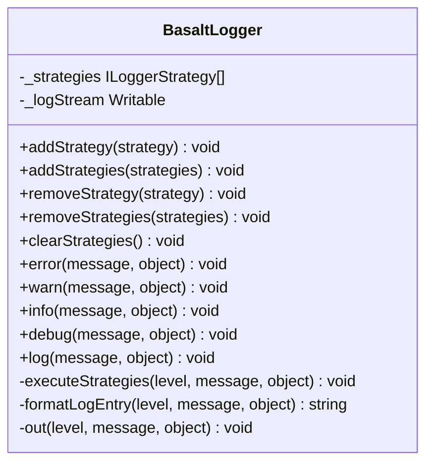

## **Référence de la classe BasaltLogger**

`BasaltLogger` est un système de journalisation flexible non bloquant, qui permet plusieurs stratégies pour la sortie des logs.

## **Diagramme**

## **Méthodes publiques**

Ci-dessous, vous trouverez les détails techniques de chaque méthode publique disponible.

### `addStrategy`

???+ info "addStrategy"

    - **Description** : Ajoute une stratégie de journalisation au logger.
    - **Signature** : `public static addStrategy(strategy: ILoggerStrategy): void`
    - **Paramètres** :
        - `strategy` : La stratégie de journalisation à ajouter.
    - **Exceptions** : Lance une erreur `BasaltLoggerError` si la stratégie est déjà ajoutée.

### `addStrategies`

???+ info "addStrategies"

    - **Description** : Ajoute plusieurs stratégies de journalisation au logger.
    - **Signature** : `public static addStrategies(strategies: ILoggerStrategy[]): void`
    - **Paramètres** :
        - `strategies` : Un tableau de stratégies de journalisation à ajouter.
    - **Exceptions** : Lance une erreur `BasaltLoggerError` si une des stratégies est déjà ajoutée.

### `removeStrategy`

???+ info "removeStrategy"

    - **Description** : Supprime une stratégie de journalisation du logger.
    - **Signature** : `public static removeStrategy(strategy: ILoggerStrategy): void`
    - **Paramètres** :
        - `strategy` : La stratégie de journalisation à supprimer.
    - **Exceptions** : Lance une erreur `BasaltLoggerError` si la stratégie n'est pas trouvée.

### `removeStrategies`

???+ info "removeStrategies"

    - **Description** : Supprime plusieurs stratégies de journalisation du logger.
    - **Signature** : `public static removeStrategies(strategies: ILoggerStrategy[]): void`
    - **Paramètres** :
        - `strategies` : Un tableau de stratégies de journalisation à supprimer.

### `clearStrategies`

???+ info "clearStrategies"

    - **Description** : Efface toutes les stratégies de journalisation du logger.
    - **Signature** : `public static clearStrategies(): void`

### `log`

???+ info "log"

    - **Description** : Méthodes pour enregistrer des messages.
    - **Signature** : `public static log(message: string, object?: unknown): void` (et similaire pour `warn`, `info`, `debug`, `error`)
    - **Paramètres** :
        - `message` : Le message à enregistrer.
        - `object` (optionnel) : Informations supplémentaires à enregistrer.
    - **Exceptions** : Lance une erreur `BasaltLoggerError` si aucune stratégie n'est ajoutée.

### `info`

???+ info "info"

    - **Description** : Méthodes pour enregistrer des messages.
    - **Signature** : `public static info(message: string, object?: unknown): void` (et similaire pour `warn`, `error`, `debug`, `log`)
    - **Paramètres** :
        - `message` : Le message à enregistrer.
        - `object` (optionnel) : Informations supplémentaires à enregistrer.
    - **Exceptions** : Lance une erreur `BasaltLoggerError` si aucune stratégie n'est ajoutée.

### `debug`

???+ info "debug"

    - **Description** : Méthodes pour enregistrer des messages.
    - **Signature** : `public static debug(message: string, object?: unknown): void` (et similaire pour `warn`, `info`, `error`, `log`)
    - **Paramètres** :
        - `message` : Le message à enregistrer.
        - `object` (optionnel) : Informations supplémentaires à enregistrer.
    - **Exceptions** : Lance une erreur `BasaltLoggerError` si aucune stratégie n'est ajoutée.

### `warn`

???+ info "warn"

    - **Description** : Méthodes pour enregistrer des messages.
    - **Signature** : `public static warn(message: string, object?: unknown): void` (et similaire pour `error`, `info`, `debug`, `log`)
    - **Paramètres** :
        - `message` : Le message à enregistrer.
        - `object` (optionnel) : Informations supplémentaires à enregistrer.
    - **Exceptions** : Lance une erreur `BasaltLoggerError` si aucune stratégie n'est ajoutée.

### `error`

???+ info "error"

    - **Description** : Méthodes pour enregistrer des messages.
    - **Signature** : `public static error(message: string, object?: unknown): void` (et similaire pour `warn`, `info`, `debug`, `log`)
    - **Paramètres** :
        - `message` : Le message à enregistrer.
        - `object` (optionnel) : Informations supplémentaires à enregistrer.
    - **Exceptions** : Lance une erreur `BasaltLoggerError` si aucune stratégie n'est ajoutée.

