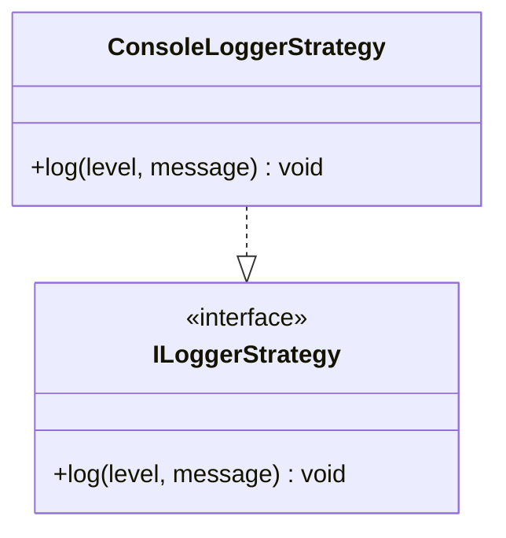

## **ConsoleLoggerStrategy Class Reference**

`ConsoleLoggerStrategy` implements `ILoggerStrategy` to provide logging functionality to the console.

## **Diagram**

## **Public Methods**

Below are the technical details of each available public method.

### `log`

???+ info "log"

    - **Description** : Logs a message to the console with the specified log level.
    - **Signature** : `public log(level: LogLevels, message: string): void`
    - **Paramètres** :
        - `level` : The log level at which the message should be logged.
        - `message` : The message to log.
    - **Comportement** : Depending on the log level, the message will be logged to the console using the `console.error`, `console.warn`, `console.info`, `console.debug`, or `console.log` functions.

