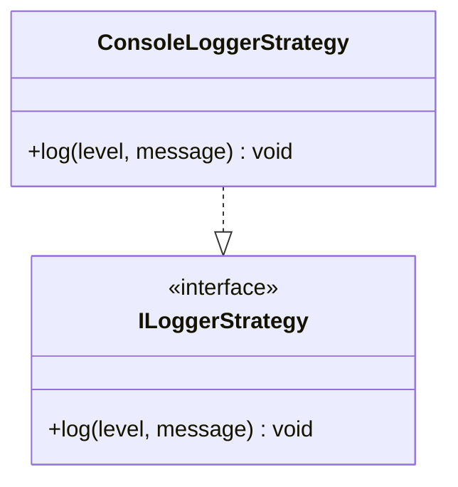

## **Référence de la classe ConsoleLoggerStrategy**

`ConsoleLoggerStrategy` implémente ILoggerStrategy pour fournir une fonctionnalité de journalisation vers la console.

## **Diagramme**

## **Méthodes publiques**

Ci-dessous, vous trouverez les détails techniques de chaque méthode publique disponible.

### `log`

???+ info "log"

    - **Description** : Enregistre un message dans la console avec le niveau de log spécifié.
    - **Signature** : `public log(level: LogLevels, message: string): void`
    - **Paramètres** :
        - `level` : Le niveau de log auquel le message doit être enregistré.
        - `message` : Le message à enregistrer.
    - **Comportement** : Selon le niveau de log, le message sera enregistré dans la console en utilisant les fonctions `console.error`, `console.warn`, `console.info`, `console.debug`, ou `console.log`.
