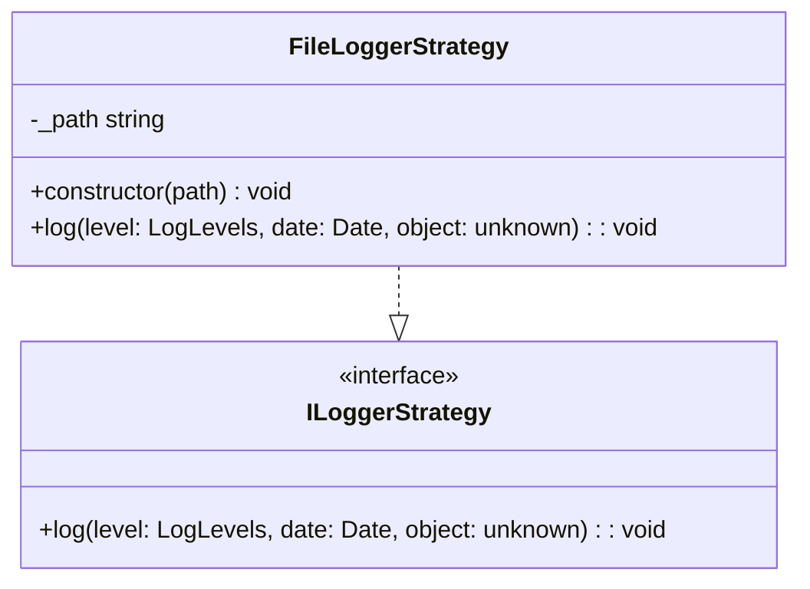

## **FileLoggerStrategy Class Reference**

`FileLoggerStrategy` implements `ILoggerStrategy` to provide logging functionality to the console.

## **Diagram**

## **Public Methods**

Below are the technical details of each available public method.

### `constructor`

???+ info "constructor"

    - **Description** : Builds a new instance of `FileLoggerStrategy`.
    - **Signature** : `constructor(path: string)`
    - **Parameter** :
        - `path` : Path to the file where logs should be saved.

### `log`

???+ info "log"

    - **Description** : Logs a message to the console with the specified log level.
    - **Signature** : `public log(level: LogLevels, message: string): void`
    - **Parameter** :
        - `level` : The log level at which the message should be logged.
        - `prefixDate` : The date prefix to use for the message.
        - `object` : The object logged.
    - **Comportement** : The message is added to the file specified in the path at construction. In case of error, an exception is thrown.
