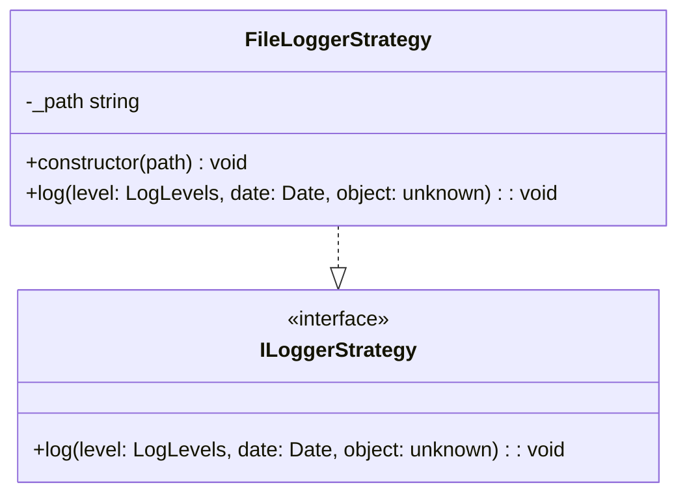

## **Référence de la classe FileLoggerStrategy**

`FileLoggerStrategy` implémente `ILoggerStrategy` pour fournir une fonctionnalité de journalisation dans le système de fichiers.

## **Diagramme**

## **Méthodes publiques**

Ci-dessous, vous trouverez les détails techniques de chaque méthode publique disponible.

### `constructor`

???+ info "constructor"

    - **Description** : Construit une nouvelle instance de `FileLoggerStrategy`.
    - **Signature** : `constructor(path: string)`
    - **Paramètres** :
        - `path` : Chemin vers le fichier où les logs doivent être enregistrés.

### `log`

???+ info "log"

    - **Description** : Enregistre un message dans le système de fichiers avec le niveau de log spécifié.
    - **Signature** : `public log(level: LogLevels, message: string): void`
    - **Paramètres** :
        - `level` : Le niveau de log auquel le message doit être enregistré.
        - `date` : The date to use as a prefix for the message.
        - `object` : L'objet enregistré.
    - **Comportement** : Le message est ajouté au fichier spécifié dans le chemin lors de la construction. En cas d'erreur, une exception est levée.
