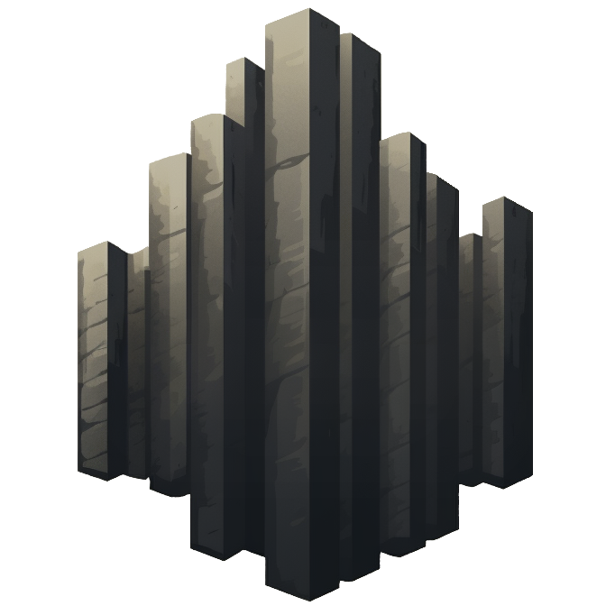

{width="150", loading=lazy, align=right}

## **Introduction**
    
Bienvenue dans la documentation de **Basalt**.

**Basalt** est une suite de packages spécialement conçue pour le développement en Node.js et développée en **TypeScript** et en **ESM**.

Chaque module de **Basalt** vise à fournir des outils efficaces et faciles à utiliser.

???+ warning "Attention"
    
    **Basalt** est actuellement en développement, et est sujet à des changements fréquents.  
    Tous les packages ne sont pas encore disponibles, et seuls certains modules de base sont opérationnels à ce jour.

La documentation et les fonctionnalités continueront d'évoluer.

Le développement de **Basalt** avance peu à peu, je travail sur plusieurs projets en parallèle, je fais donc au mieux avec le temps que je dispose.

Il est actuellement recommandé pour des projets expérimentaux ou non critiques.

N'hésitez pas à me contacter pour toute question ou suggestion ou même si vous souhaitez rapporter un bug.

## **Contact**

*Vous pouvez me contacter sur : [basalt-lab@proton.me](mailto:basalt-lab@proton.me) ou sur Discord : `necrelox`*

!!! note
        
    Si vous voyez des erreurs, j'en suis vraiment désolé je fais de mon mieux c'est la première fois que je fais ça.  
    N'hésitez pas si vous souhaité discuter ou participer à ce projet, je suis ouvert à toute proposition.

<script data-name="BMC-Widget"
        data-cfasync="false"
        src="https://cdnjs.buymeacoffee.com/1.0.0/widget.prod.min.js"
        data-id="necrelox"
        data-description="Support me on Buy me a coffee!"
        data-message="Merci pour votre visite !"
        data-color="#5F7FFF"
        data-position="Right"
        data-x_margin="18"
        data-y_margin="22" />